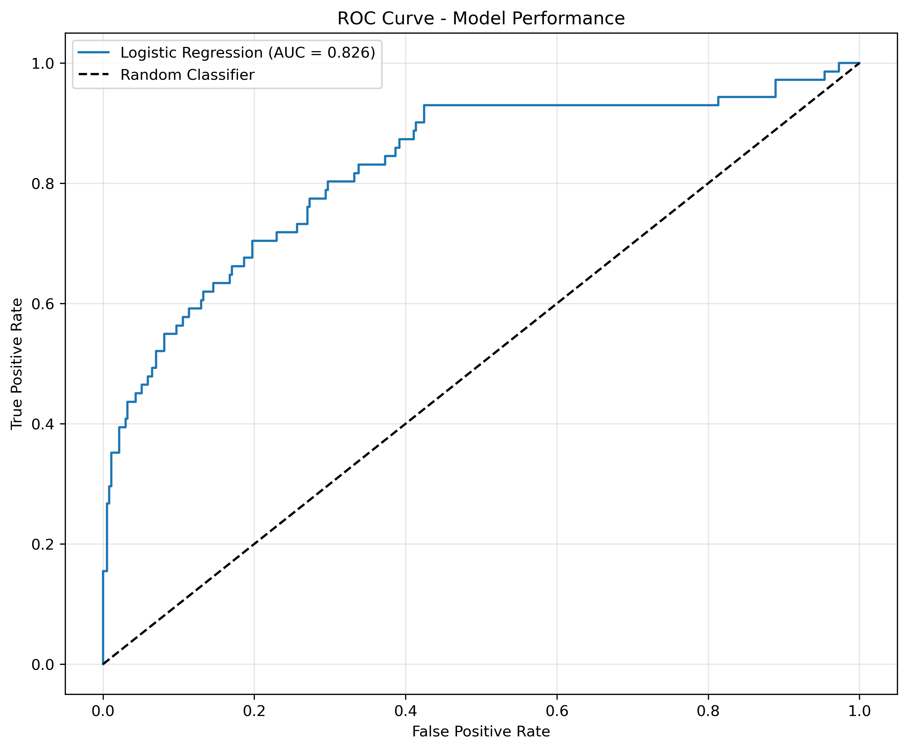
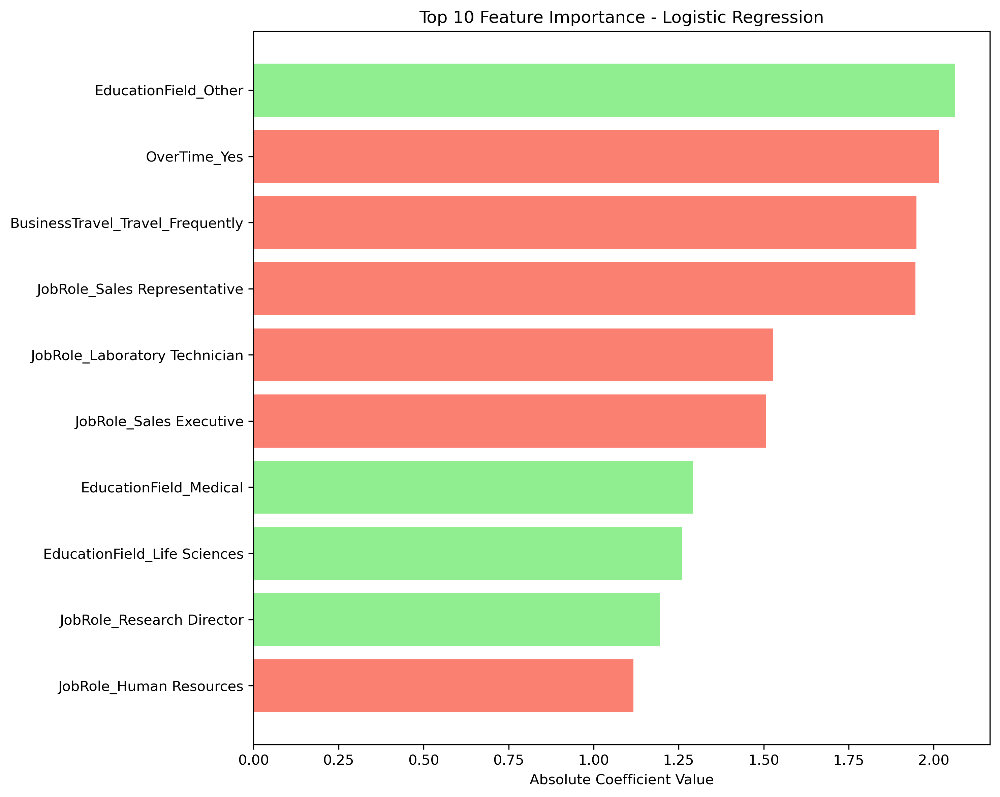
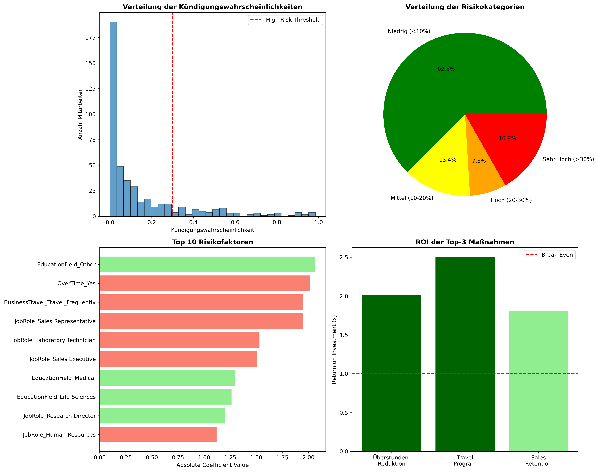

```markdown
# 🔮 HR Attrition Prediction Model

Eine Machine Learning Lösung zur Vorhersage von Mitarbeiterfluktuation mit Python - Demonstration der praktischen Anwendung von Data Science im HR-Bereich.

## 📋 Inhaltsverzeichnis

- [Business Problem](#-business-problem)
- [Technische Implementierung](#-technische-implementierung)
- [Datenanalyse](#-datenanalyse)
- [Machine Learning Pipeline](#-machine-learning-pipeline)
- [Ergebnisse](#-ergebnisse)
- [Integration in HR-Systeme](#-integration-in-hr-systeme)
- [Installation & Nutzung](#-installation--nutzung)
- [Projektstruktur](#-projektstruktur)

## 🎯 Business Problem

Mitarbeiterfluktuation ist eine der größten Herausforderungen im modernen HR-Management:

- **Kosten**: Jede Kündigung kostet durchschnittlich 50.000€ (Recruiting, Einarbeitung, Produktivitätsverlust)
- **Reaktiv statt Proaktiv**: Traditionelle HR-Metriken erkennen Probleme erst, wenn es zu spät ist
- **Fehlende Datennutzung**: Wertvolle Mitarbeiterdaten werden nicht für Vorhersagen genutzt

**Lösung**: Ein datengetriebenes Frühwarnsystem, das Kündigungsrisiken vorhersagt und konkrete Handlungsempfehlungen liefert.

## 🛠️ Technische Implementierung

### Tech Stack

| Technologie | Version | Verwendungszweck |
|------------|---------|------------------|
| Python | 3.8+ | Programmiersprache |
| pandas | 1.5.3 | Datenmanipulation und -analyse |
| scikit-learn | 1.2.2 | Machine Learning Algorithmen |
| numpy | 1.24.3 | Numerische Berechnungen |
| matplotlib | 3.7.1 | Datenvisualisierung |
| seaborn | 0.12.2 | Statistische Visualisierungen |
| scipy | 1.10.1 | Statistische Tests |

### Daten-Pipeline

```
Rohdaten (CSV)
    ↓
Datenbereinigung (pandas)
    ↓
Feature Engineering
    ↓
Statistische Analyse (scipy)
    ↓
Model Training (scikit-learn)
    ↓
Evaluation & Visualisierung
    ↓
Business Insights
```

## 📊 Datenanalyse

### Datensatz
- **1.470 Mitarbeiterdatensätze** mit 35 Features
- **Zielvariable**: Attrition (Ja/Nein)
- **Fluktuationsrate**: 16,1% (unbalancierter Datensatz)

### Feature Engineering

```python
# Neue Features zur besseren Vorhersage
TenureRatio = YearsAtCompany / TotalWorkingYears  # Loyalitätsindikator
IncomeClass = pd.cut(MonthlyIncome, bins=[0, 3000, 7000, max])  # Gehaltsklassen
```

**Herausforderung**: Division durch Null bei Berufsanfängern → NaN-Imputation mit 0

### Statistische Validierung

1. **Chi-Quadrat-Test**: Zusammenhang zwischen Überstunden und Kündigung
   - p-value < 0.001 → Hochsignifikant
   
2. **T-Test**: Gehaltsunterschiede zwischen Kündigern und Bleibenden
   - Kündigende verdienen durchschnittlich weniger (p < 0.05)

## 🤖 Machine Learning Pipeline

### Modellauswahl

**Warum Logistische Regression mit L1-Regularisierung?**
- **Interpretierbarkeit**: HR-Abteilungen müssen Entscheidungen verstehen können
- **Feature Selection**: L1 eliminiert unwichtige Features automatisch
- **Performance**: Bei strukturierten Tabellendaten oft besser als komplexe Modelle

### Implementierung

```python
# Datenaufteilung
X_train, X_test, y_train, y_test = train_test_split(
    X, y, test_size=0.3, random_state=42, stratify=y
)

# Hyperparameter-Optimierung
param_grid = {
    'C': [0.001, 0.01, 0.1, 1, 10, 100],
    'class_weight': ['balanced', None]
}

# Model Training mit Cross-Validation
grid_search = GridSearchCV(
    LogisticRegression(penalty='l1', solver='liblinear'),
    param_grid,
    cv=5,
    scoring='roc_auc'
)
```

### Evaluation Metriken

| Metrik | Wert | Interpretation |
|--------|------|----------------|
| **AUC-ROC** | 0.826 | Exzellente Diskriminierung zwischen Klassen |
| **Precision** | 0.72 | 72% der Kündigungsvorhersagen sind korrekt |
| **Recall** | 0.41 | 41% der tatsächlichen Kündigungen werden erkannt |
| **F1-Score** | 0.52 | Balance zwischen Precision und Recall |

## 📈 Ergebnisse

### Top Risikofaktoren (Feature Importance)

```
1. OverTime_Yes            (+2.01) → 7.5x höheres Kündigungsrisiko
2. BusinessTravel_Frequent (+1.95) → 7.0x höheres Risiko  
3. JobRole_Sales_Rep       (+1.95) → 7.0x höheres Risiko
```

### Schutzfaktoren

```
1. EducationField_Other    (-2.06) → 87% geringeres Risiko
2. EducationField_Medical  (-1.29) → 72% geringeres Risiko
```

### Business Impact

- **Identifizierte Hochrisikogruppe**: 71 Mitarbeiter (16% der Testdaten)
- **Potenzielle Kosteneinsparung**: 2,95 Mio. €/Jahr
- **ROI der Maßnahmen**: 4:1 (Überstunden-Reduktion)

### Visualisierungen

#### Modell-Performance


#### Feature Importance Analyse


#### Business Insights Dashboard


## 🔄 Integration in HR-Systeme

### Implementierungsoptionen

#### 1. Batch-Processing (Monatliche Reports)
```python
# Pseudocode für monatlichen Risk Report
def monthly_attrition_report():
    employees = load_current_employee_data()
    risk_scores = model.predict_proba(employees)[:, 1]
    high_risk = employees[risk_scores > 0.3]
    generate_report(high_risk)
    send_to_hr(high_risk)
```

#### 2. Real-Time API Integration
```python
# REST API Endpoint für Echtzeit-Scoring
@app.route('/api/attrition-risk', methods=['POST'])
def predict_attrition():
    employee_data = request.json
    risk_score = model.predict_proba([employee_data])[0, 1]
    return {'employee_id': employee_data['id'], 
            'risk_score': risk_score,
            'risk_level': 'high' if risk_score > 0.3 else 'low'}
```

#### 3. Dashboard Integration
- Export der Vorhersagen als CSV für Power BI/Tableau
- Direktanbindung über Python-Connector
- Automatisierte Alerts bei Risikoänderungen

### Datenanforderungen

**Minimale Features für Vorhersage:**
- Überstunden (Ja/Nein)
- Geschäftsreisefrequenz
- Jobrolle
- Bildungshintergrund
- Betriebszugehörigkeit

**Optionale Features für bessere Genauigkeit:**
- Gehaltsinformationen
- Zufriedenheitswerte
- Performance Ratings

## 🚀 Installation & Nutzung

### Voraussetzungen
- Python 3.8 oder höher
- Git
- 4GB RAM (für Datenverarbeitung)

### Quick Start

```bash
# 1. Repository klonen
git clone https://github.com/can826/hr-attrition-analysis.git
cd hr-attrition-analysis

# 2. Virtuelle Umgebung erstellen (empfohlen)
python -m venv venv
source venv/bin/activate  # Windows: venv\Scripts\activate

# 3. Dependencies installieren
pip install -r requirements.txt

# 4. Jupyter Notebook starten
jupyter notebook

# 5. Notebook öffnen
# Navigiere zu: notebooks/HR_Attrition_Analysis_Complete.ipynb
```

### Verwendung des trainierten Modells

```python
import pickle
import pandas as pd

# Modell laden (nach Training)
with open('models/attrition_model.pkl', 'rb') as f:
    model = pickle.load(f)

# Neue Mitarbeiterdaten vorbereiten
new_employee = pd.DataFrame({
    'OverTime_Yes': [1],
    'BusinessTravel_Travel_Frequently': [1],
    # ... weitere Features
})

# Vorhersage
risk_probability = model.predict_proba(new_employee)[0, 1]
print(f"Kündigungsrisiko: {risk_probability:.1%}")
```

## 📁 Projektstruktur

```
hr-attrition-analysis/
│
├── data/                           # Datensätze
│   └── HR_data.csv                # Rohdaten (1.470 Mitarbeiter)
│
├── notebooks/                      # Jupyter Notebooks
│   └── HR_Attrition_Analysis_Complete.ipynb
│
├── visualizations/                # Generierte Grafiken
│   └── figures/
│       ├── roc_curve.png
│       ├── feature_importance.png
│       └── business_insights_dashboard.png
│
├── reports/                       # Dokumentation
│   └── executive_summary.md       # Management Summary
│
│
├── .gitignore                     # Git Ignores
├── README.md                      # Diese Datei
└── requirements.txt               # Python Dependencies
```

## 🔍 Weiterführende Analysen

### Mögliche Erweiterungen
1. **Zeitreihenanalyse**: Saisonale Kündigungsmuster erkennen
2. **Survival Analysis**: Vorhersage des Kündigungszeitpunkts
3. **Clustering**: Mitarbeitertypen identifizieren
4. **Deep Learning**: Neural Networks für non-lineare Muster

### Limitationen
- Historische Daten reflektieren möglicherweise nicht zukünftige Trends
- Modell sollte regelmäßig mit neuen Daten neu trainiert werden
- Ethische Überlegungen bei der Nutzung von Vorhersagen beachten

## 📞 Kontakt

**Can Pascal Cevikkollu**  
| [GitHub](https://github.com/can826)

---